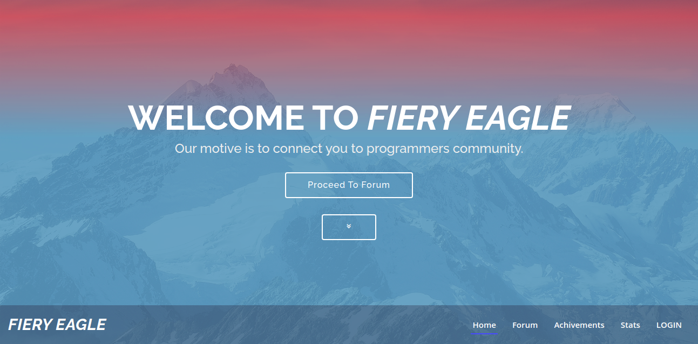
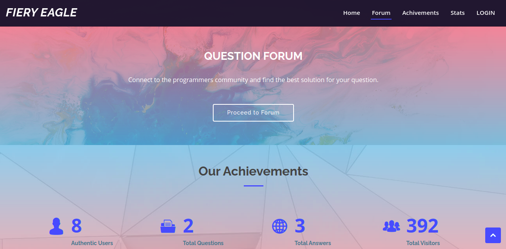
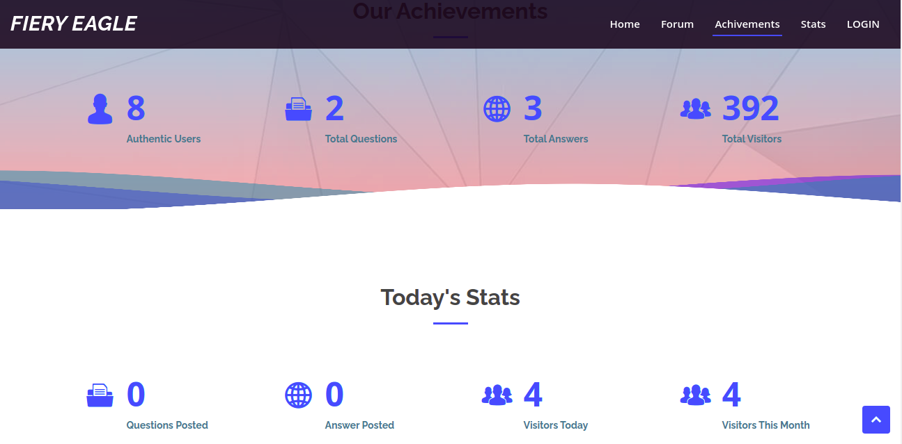
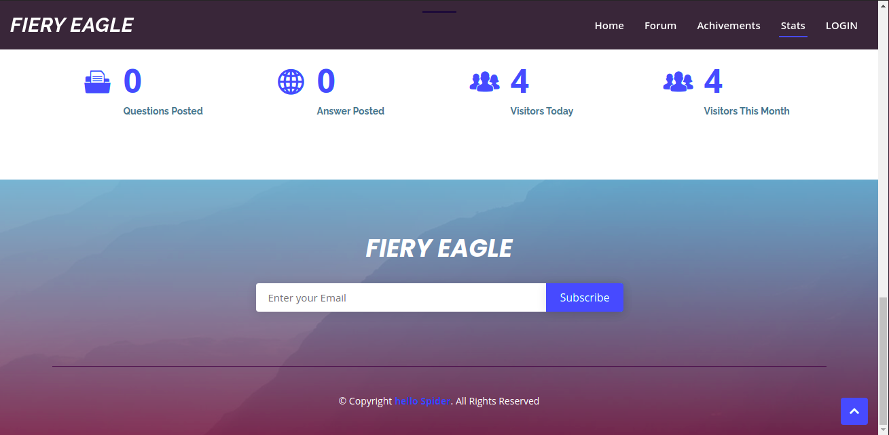
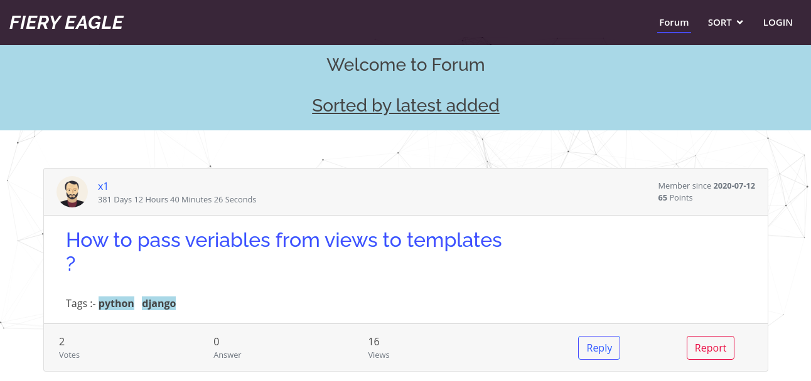
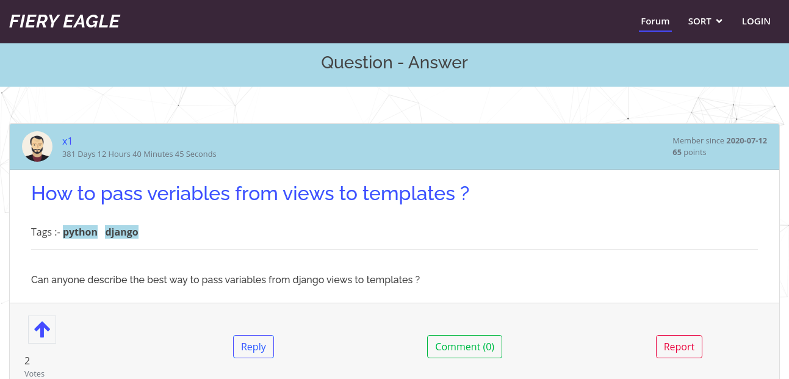

<h3 align="center">FIERY EAGLE</h3>

---

<div align="center">

[](https://github.com/novicexp/fiery-eagle)

 

</div>

---

## 📝 Table of Contents

- [About](#about)
- [Getting Started](#getting_started)
- [Built Using](#built_using)
- [Screenshots](#screenshots)

## 🧐 About <a name = "about"></a>

A Simple online question-answer forum.

## 🏁 Getting Started <a name = "getting_started"></a>

- clone project
  ```
  git clone https://github.com/novicexp/fiery-eagle
  ```
  ```
  cd fiery-eagle/
  ```
- install requirements
  ```
  pip install -r requirements.txt
  ```
- migrate
  ```
  python manage.py migrate
  ```
- runserver
  ```
  python manage.py runserver
  ```

---

**Note :-** Tested on `Ubuntu 20.04`

---

## ⛏️ Built Using <a name = "built_using"></a>

- [DJANGO](https://www.djangoproject.com/)

## Screenshots <a name = "screenshots"></a>

<p align="center">

</p>

<p align="center">

</p>

<p align="center">

</p>

<p align="center">

</p>

<p align="center">

</p>

<p align="center">

</p>

---

Dev Period :- `23rd July 2020` - `9th August 2020`

---

<p align="center">
Thanks :)
</p>